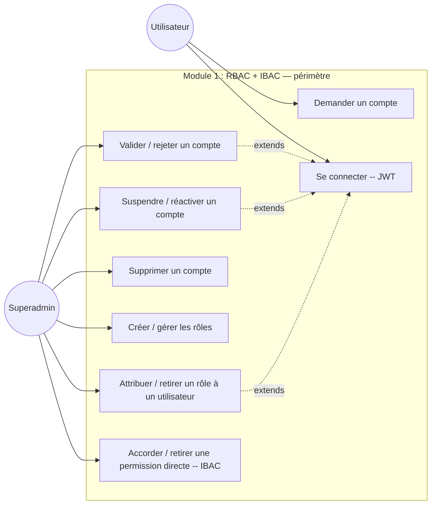
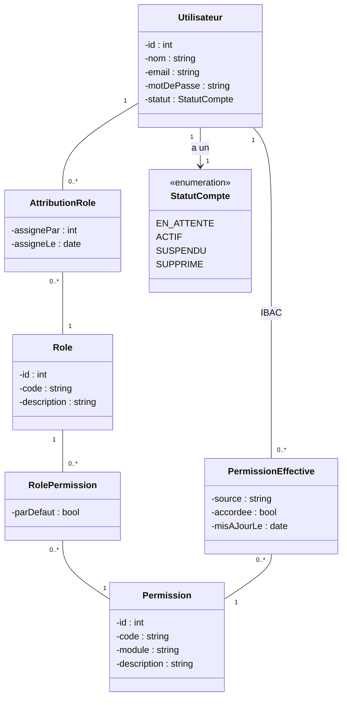
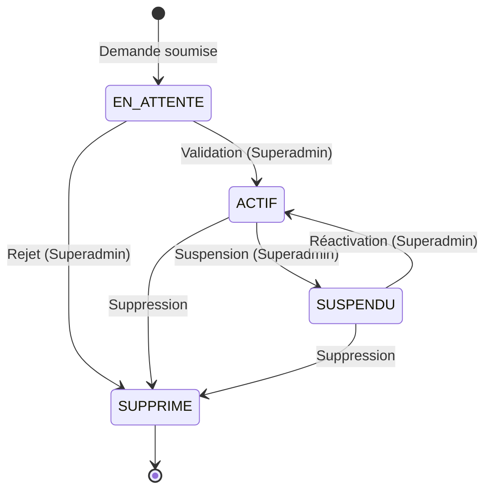
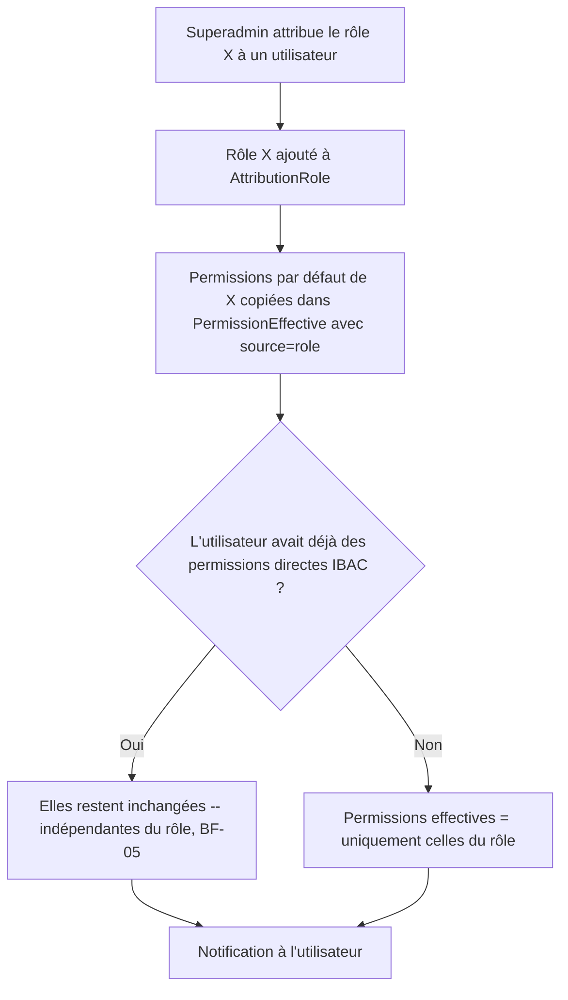
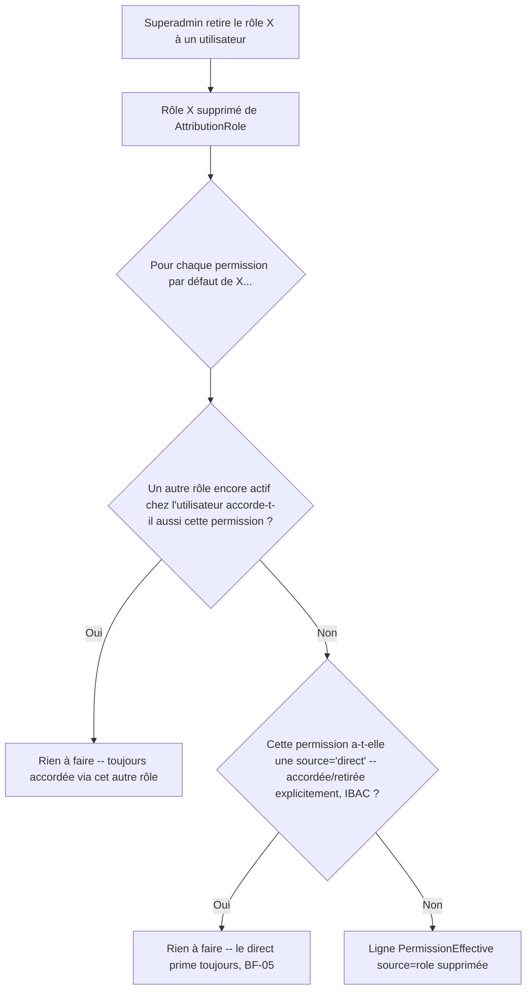

# Document d'Analyse — Correctif v1.1

## AGT ERP : Module 1 : RBAC + IBAC + Tableau de bord squelette

| | |
|---|---|
| **Auteur** | Hapket Darelle (cheffe d'équipe) |
| **Encadrant** | NOMO BODIANGA Gabriel |
| **Semaine** | S1 → corrections début S2 — 27 juillet au 5 août 2026 |
| **Version** | 1.1 (corrige la v1.0 du 28 juillet 2026) |
| **Statut** | Document d'analyse — corrections post-relecture, avant développement du Module 2 (matériel), qui repose sur le même socle rôles/permissions/authentification |

---

## 0. Pourquoi cette révision

La v1.0 appelait le système « RBAC » seul, plaçait `Projet` dans le diagramme de classes du Module 1, et modélisait le rôle global comme un enum figé (`RoleGlobal`). Cinq corrections sont apportées :

1. **Le système est RBAC + IBAC**, pas RBAC seul. Certaines permissions ne dépendent pas du rôle : elles peuvent être accordées ou retirées directement à un utilisateur (BF-05 du CDC), indépendamment de tout rôle. Cette flexibilité est de l'**IBAC** (Identity-Based Access Control : la permission est attachée à l'identité, pas seulement au rôle).
2. **`Projet` est retiré du diagramme de classes.** Le Module 1 porte sur RBAC + IBAC uniquement ; le module Projet est un module distinct, déjà réalisé, qui ne doit pas polluer ce diagramme.
3. **Relation directe Utilisateur ↔ Permission ajoutée** au diagramme de classes : c'est elle qui matérialise l'IBAC.
4. **L'enum `RoleGlobal` est supprimé.** `Role` est déjà une classe/table dans le diagramme — un enum à côté ferait doublon avec une entité qui existe réellement en base.
5. **`Admin` retiré des acteurs du cas d'utilisation.** Admin est un rôle attribué par le Superadmin via la gestion des rôles, pas un acteur du système au sens UML. Les vrais acteurs sont le **Superadmin** (crée les utilisateurs, attribue les rôles) et l'**Utilisateur** (accède aux ressources selon ses permissions effectives, quel que soit le rôle qu'il porte).
6. **Correction comportementale du retrait de rôle (2026-08-10, bug rapporté en test).** BF-05 dit « permissions copiées à l'attribution du rôle, puis modifiables indépendamment » ; l'implémentation initiale (`revoke_role`) prenait ça au pied de la lettre et ne retirait **jamais** les permissions copiées, même quand le rôle qui les avait données était lui-même retiré — un utilisateur passé d'Admin à Membre gardait par exemple `membres.delete`. Comportement corrigé : retirer un rôle retire désormais les permissions que **ce rôle précis** avait copiées (`source='role'`), sauf si (a) un autre rôle encore actif chez l'utilisateur les accorde aussi, ou (b) elles ont été accordées/retirées **directement** (`source='direct'`, IBAC) — ce second cas reste, lui, inchangé et toujours prioritaire, conformément à BF-05. Le diagramme de séquence retrait-de-rôle (section 5) et la spécification `Document_Conception_Module1_RBAC-IBAC_v1.1.md` sont mis à jour en conséquence.

La cohérence entre le diagramme de classes et le diagramme d'états/transitions est rétablie en conséquence (section 5).

---

## 1. Identification des acteurs

**Règle fondamentale inchangée :** deux niveaux de rôles indépendants — rôles globaux (plateforme) et rôles projet (par projet, hors périmètre de ce module).

| Acteur UML | Description |
|---|---|
| **Superadmin** | Créé automatiquement au démarrage. Crée les comptes, attribue/retire les rôles, gère les permissions directes de chaque utilisateur. Accès total. |
| **Utilisateur** | Toute personne connectée. Ce qu'il peut faire dépend uniquement de ses **permissions effectives** (héritées de ses rôles + accordées/retirées directement). Admin, Chef de projet et Membre ne sont plus des acteurs séparés dans ce diagramme : ce sont des **rôles** qu'un Utilisateur peut porter, au même titre que n'importe quel autre rôle défini dans la table `Role`. |

> Admin, Chef de projet et Membre restent des **rôles** au sens métier (voir le CDC, section 2 « Acteurs du système ») — mais au sens UML de ce diagramme de cas d'utilisation, ce sont des états de l'acteur *Utilisateur*, pas des acteurs distincts. Un Admin n'a pas de capacité que le système traite différemment d'un Utilisateur générique : il a simplement un jeu de permissions plus large, accordé par le Superadmin.

---

## 2. Diagramme des cas d'utilisation (corrigé)

**Changements vs v1.0 :** `Admin` disparaît comme acteur ; ses cas d'utilisation (valider/rejeter, suspendre/réactiver, supprimer un compte) reviennent au **Superadmin**, qui reste seul capable de gérer le cycle de vie des comptes et des rôles dans ce module. `Gérer rôles et permissions` est scindé en deux cas plus précis et testables : `Créer/gérer les rôles` (RBAC) et `Accorder/retirer une permission directe` (IBAC), pour bien matérialiser les deux mécanismes.

---

## 3. Description des cas d'utilisation principaux

### UC — Accorder une permission directe à un utilisateur (IBAC)

| | |
|---|---|
| **Acteur principal** | Superadmin |
| **Précondition** | Le Superadmin est connecté. L'utilisateur cible existe et est actif. |
| **Scénario nominal** | 1. Le Superadmin consulte le profil de permissions de l'utilisateur (héritées de ses rôles + directes). 2. Il sélectionne une permission précise et l'accorde ou la retire, indépendamment de tout rôle. 3. La permission directe est enregistrée avec sa source (`direct`) pour la distinguer d'une permission héritée d'un rôle (`role`). 4. L'utilisateur ne récupère plus jamais automatiquement cette permission via son rôle si elle a été retirée directement : le retrait direct prime. |
| **Postcondition** | Les permissions effectives de l'utilisateur reflètent l'ajustement, indépendamment de ses rôles. |
| **Règle métier** | Une permission accordée ou retirée directement reste indépendante du rôle même si celui-ci change ensuite (cohérent avec BF-05 du CDC). |

### UC — Attribuer un rôle à un utilisateur

| | |
|---|---|
| **Acteur principal** | Superadmin |
| **Précondition** | Le Superadmin est connecté. Le rôle visé existe dans `Role`. |
| **Scénario nominal** | 1. Le Superadmin sélectionne un utilisateur et un rôle. 2. Le rôle est ajouté à l'ensemble des rôles de l'utilisateur (un utilisateur peut porter plusieurs rôles — BF-04). 3. Les permissions par défaut du rôle sont **copiées** dans les permissions effectives de l'utilisateur, avec la source `role`. 4. Une notification est envoyée à l'utilisateur promu. |
| **Postcondition** | L'utilisateur porte le nouveau rôle en plus de ses rôles existants ; ses permissions effectives sont mises à jour. |

*(Les UC « Valider / rejeter un compte » et « Se connecter (JWT) » restent inchangés par rapport à la v1.0, seul l'acteur « Admin » devient « Superadmin » pour le premier.)*

---

## 4. Diagramme de classes métier (corrigé)

**Changements vs v1.0 :**
- `Projet` et `MembreProjet` supprimés — hors périmètre du Module 1.
- `RoleGlobal` (enum) supprimé — `Role` est une classe à part entière, alimentée en base (BF-02 du CDC : permissions et rôles créés par le code, pas ajoutés à la main).
- Association `Utilisateur ↔ Permission` ajoutée via la classe-association `PermissionEffective`, qui porte `source` (`role` ou `direct`) et `accordee` (bool) — c'est elle qui rend le système RBAC **+ IBAC** : une permission peut être accordée ou retirée à un utilisateur précis, indépendamment de ses rôles (BF-05).
- `AttributionRole` explicite le lien Utilisateur↔Role en many-to-many (un utilisateur peut porter plusieurs rôles — BF-04) avec traçabilité (`assignePar`, `assigneLe` — BNF-03).

---

## 5. Diagrammes d'états/transitions (cohérence rétablie)

### 5.1 Cycle de vie d'un compte utilisateur (`StatutCompte`) — inchangé

Ce diagramme ne change pas : il décrit `Utilisateur.statut`, un vrai enum sur un vrai champ à valeur unique — un compte n'a qu'un seul statut à la fois, donc un diagramme d'états classique reste correct ici.

### 5.2 Attribution des rôles — ce n'est plus un diagramme d'états

La v1.0 modélisait le rôle global comme un cycle d'états exclusifs (`MEMBRE ↔ CHEF_PROJET`, `ADMIN` à part). C'était **incohérent avec le diagramme de classes corrigé** : depuis que `Role` est une relation many-to-many avec `Utilisateur` (BF-04 : un utilisateur peut avoir plusieurs rôles), un utilisateur ne transite plus d'un état de rôle unique à un autre — il **accumule ou perd des rôles indépendamment les uns des autres**, comme des tags. Un diagramme d'états à un seul jeton n'a plus de sens ici.

À la place, l'activité ci-dessous remplace l'ancien diagramme d'états pour ce cas :

> **Cas particulier `chef_projet` observé dans l'implémentation actuelle (`RBAC.md`) :** ce rôle sert de verrou de création de projet, retiré automatiquement quand l'utilisateur ne possède plus aucun projet (`_demote_if_orphan`). C'est un exemple concret d'attribution/retrait de rôle piloté par une règle métier plutôt que par une action manuelle du Superadmin — le diagramme d'activité ci-dessus s'applique aussi à ce cas automatique, avec « Superadmin » remplacé par « règle métier automatique ».

### 5.3 Retrait d'un rôle — comportement corrigé (2026-08-10)

Avant cette correction, l'étape D/F/H n'existait pas : la ligne `PermissionEffective` créée à
l'attribution du rôle survivait indéfiniment à son retrait, tant qu'aucun retrait direct
explicite ne l'effaçait — lu littéralement, BF-05 (« permissions copiées puis modifiables
indépendamment ») ne distinguait pas « copie orpheline après retrait du rôle source » de «
permission volontairement rendue indépendante ». Un compte passé d'Admin à Membre gardait par
exemple `membres.delete`. La distinction (D) et (F) ci-dessus restaure l'intention réelle de
BF-05 : seule une permission **explicitement** détachée de son rôle d'origine (accordée ou
retirée en direct) doit survivre au retrait de ce rôle.

---

## 6. Diagramme de packages — inchangé

Toujours valide : `Authentification → Utilisateurs/Rôles → Permissions`, avec `Projets` et `Tableau de bord` en dépendance externe (hors périmètre Module 1, non détaillés ici).

---

## 7. Conclusion

Cette révision recentre le Module 1 strictement sur RBAC + IBAC : la table `Role` remplace l'enum figé, la relation directe Utilisateur↔Permission matérialise l'IBAC, `Projet` sort du diagramme de classes, `Admin` sort des acteurs (c'est un rôle, pas un acteur), et le diagramme d'états du rôle global est remplacé par un diagramme d'activité cohérent avec le modèle multi-rôles du diagramme de classes.

---

*Document d'analyse — Module 1 RBAC + IBAC — AGT ERP — version 1.1 — corrige la version 1.0 du 28 juillet 2026 — Hapket Darelle.*
