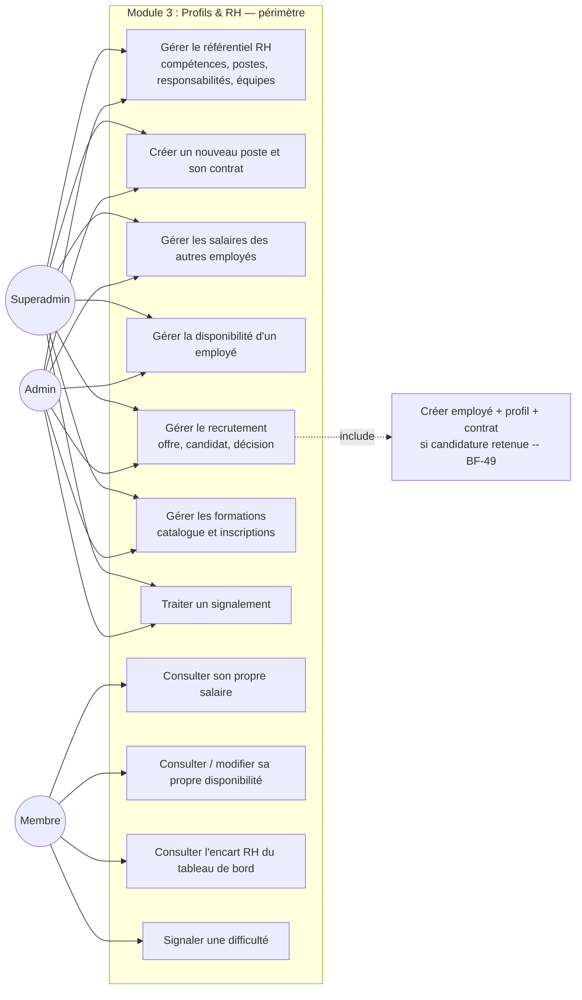
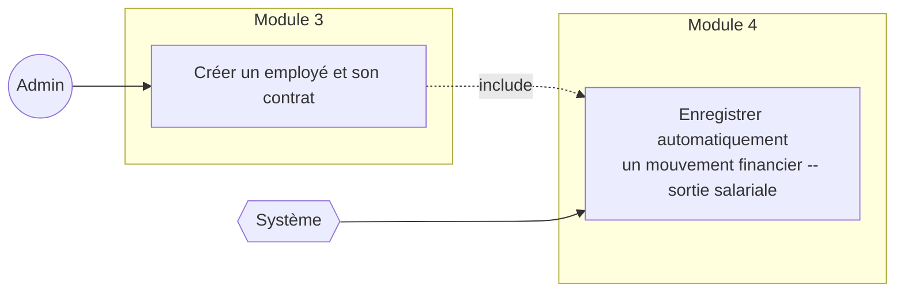
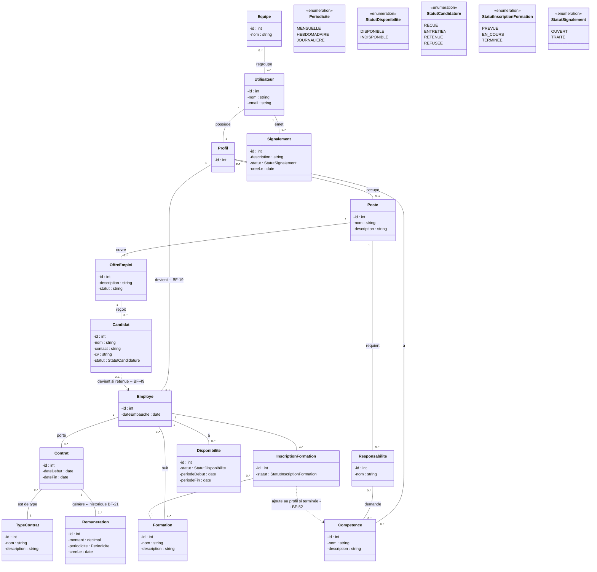
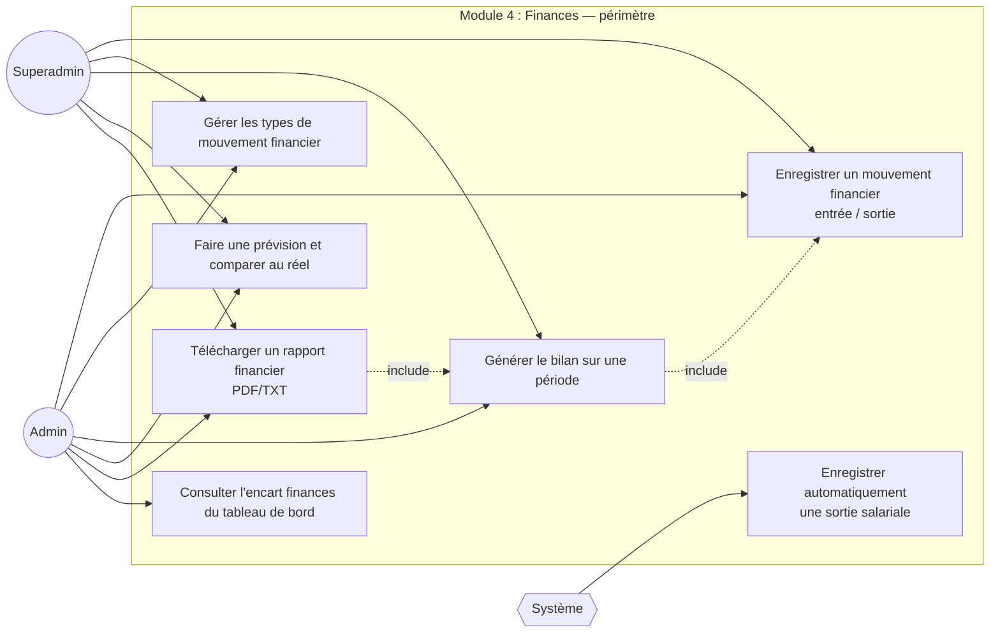
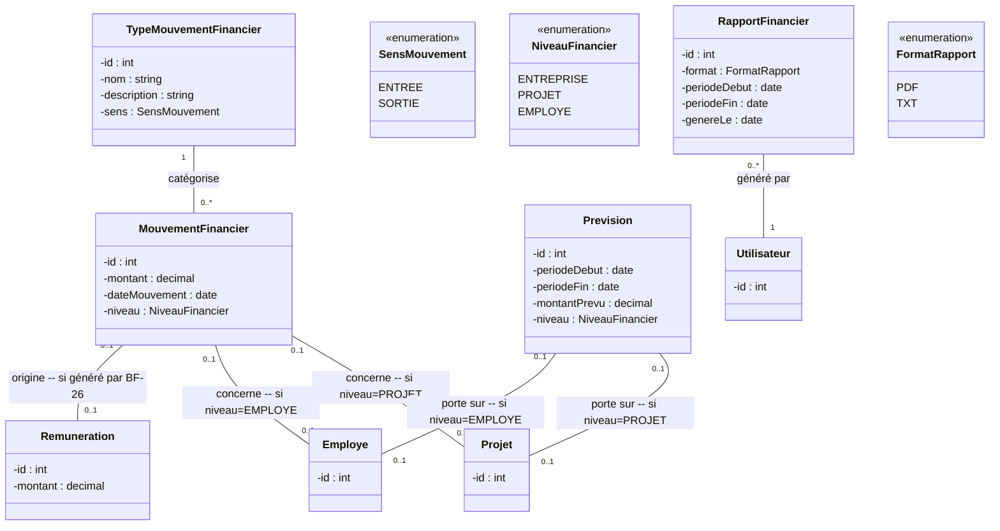

# Document d'Analyse — Version améliorée v1.1

## AGT ERP : Module 3 — Profils & Ressources Humaines et Module 4 — Finances

| | |
|---|---|
| **Auteure** | Hapket Darelle (cheffe d'équipe) |
| **Encadrant** | NOMO BODIANGA Gabriel |
| **Base** | `CahierAnalyseModule3_4_ERP.pdf` (v1.0, Hapket Darelle) |
| **Semaine** | S3 (Profils & RH) et S4 (Finances) |
| **Version** | 1.1 — révise et complète la v1.0 du cahier PDF |
| **Statut** | Document d'analyse — la conception suit dans un document séparé (`Document_Conception_Module3-4_v1.0.md`) |

---

## 0. Pourquoi cette révision

Le cahier v1.0 (PDF) pose une base solide et cohérente : le choix de traiter le Module 3 avant le Module 4 (dépendance réelle via `Remuneration`, BF-26), la confidentialité RH revue pour laisser chacun voir son propre salaire, l'immutabilité des mouvements financiers. Cinq points sont néanmoins corrigés ou complétés ici, trois au niveau du cahier lui-même, deux au niveau du CDC global dont il découle :

1. **L'acteur Admin est mal décrit dans le tableau des acteurs du Module 3** (« Le boss de l'entreprise »). Le CDC global (section 2) attribue ce rôle au **Superadmin** (« Le directeur général d'AG Technologies ») ; Admin y est « désigné par le superadmin », un délégué opérationnel, pas le dirigeant. Corrigé en section 2.
2. **Le cas d'utilisation « Enregistrer automatiquement une sortie salariale » (Module 4) est une bulle UML sans acteur relié.** Le cahier v1.0 le signale lui-même comme inhabituel sans le corriger. Un cas d'utilisation sans acteur n'est pas un diagramme UML valide : il doit soit avoir un acteur système, soit être modélisé comme `<<include>>` d'un autre cas. Corrigé en section 5.2.
3. **La cardinalité Profil ↔ Employé n'était pas explicite.** BF-19 dit « créer un employé **rattaché à** un profil qui existe déjà » — c'est une association, pas un cas de généralisation UML. Précisée en section 6.1 avec ses multiplicités.
4. **Le CDC global contredit sa propre section 4.4 sur la question « tout membre est-il un employé ? »** La section 2 (Acteurs) énonce « Règle de base : tout membre est aussi un employé », sans exception. Mais BF-19 exige une action explicite (« créer un employé ») et BF-49 (recrutement) ne crée l'employé qu'à la validation d'une candidature — ce qui n'a de sens que si un membre peut exister **sans** être encore employé (ex. un compte en attente, un profil créé mais pas encore sous contrat). Proposition d'amendement du CDC en section 8.
5. **BNF-09 du CDC global, pris au pied de la lettre, empêcherait un employé de voir son propre salaire** (« Les salaires ne sont visibles que par le superadmin et l'admin »). Le cahier v1.0 corrige déjà cela localement (« BNF-09 révisé »). Ce document propose de faire remonter la correction dans le CDC lui-même plutôt que de la garder comme dérogation propre au module. Voir section 8.
6. **Ajout hors périmètre initial (2026-08-10)** : congés et notes de frais (espace salarié self-service). Ni le CDC v1.0 ni ce cahier ne prévoyaient ces deux fonctionnalités — ajoutées à la demande explicite du donneur d'ordre, une fois « consulter et télécharger sa fiche de paie » reconnu comme une attente RH de base (cf. point 5 ci-dessus, même logique de confidentialité étendue). Modèles `Conge` et `NoteFrais`, symétriques : un employé pose sa demande (statut `en_attente`), peut l'annuler tant qu'elle n'est pas traitée ; Admin/Superadmin la valide ou la refuse avec un commentaire (permissions `rh.conges.gerer` / `rh.notes_frais.gerer`, même règle d'attribution que le reste du catalogue RH — cf. §4 de `Document_Conception_Module3-4_v1.0.md`, Membre et Chef de projet n'en obtiennent aucune). Aucun solde de congés calculé, aucun justificatif de dépense joint — périmètre volontairement minimal, à étendre si le besoin se confirme. CDC global et cahier v1.0 à amender formellement pour intégrer ces deux BF.

Le reste du cahier v1.0 (BF-46 à BF-53, BNF-17/18, les cas d'utilisation métier, la décomposition en deux parties) reste valide et sert de socle à ce document.

---

# Partie I — Module 3 : Profils & Ressources Humaines

## 1. Périmètre

Le Module 3 fait évoluer AGT ERP vers la gestion des profils et des ressources humaines. Il s'appuie directement sur le socle RBAC + IBAC du Module 1 (permissions effectives) et reste indépendant du Module 2 (Matériel). Il couvre BF-15 à BF-24 (CDC global, section 4.4) et les trois extensions BF-46 à BF-53 introduites par le cahier v1.0 (recrutement, formation, signalement de difficultés).

**Principe directeur :** tout utilisateur inscrit possède automatiquement un `Profil` (compétences, poste, responsabilités). Un sous-ensemble de ces profils devient formellement `Employe`, porteur d'un `Contrat` et d'une `Remuneration` — cette distinction Profil/Employé est nécessaire à la cohérence du modèle (voir §0.4 et §6.1) et sert directement le Module 4, qui référence `Remuneration` pour automatiser le lien salaire → mouvement financier (BF-26).

## 2. Identification des acteurs (corrigée)

| Acteur UML | Description |
|---|---|
| **Superadmin** | Le directeur général d'AG Technologies (CDC, section 2). Hérite de tout ce que fait Admin (généralisation UML). |
| **Admin** | Délégué par le Superadmin pour piloter le quotidien. Seul acteur qui gère le référentiel RH (compétences, postes, équipes), crée les employés et les contrats, pilote les salaires des autres, le recrutement, les formations. |
| **Membre** | Tout collaborateur. Consulte et gère uniquement ses propres données (salaire, disponibilité), et peut signaler une difficulté. |

> **Correctif vs cahier v1.0 :** le tableau original qualifiait Admin de « boss de l'entreprise ». Le CDC global (section 2, tableau des acteurs) attribue explicitement ce rôle au Superadmin (« directeur général »), Admin y étant « désigné par le superadmin » — un rôle délégué, pas le sommet hiérarchique. La description fonctionnelle d'Admin (gère le référentiel RH, crée les employés, pilote les salaires des autres) reste inchangée ; seule l'étiquette « boss » est retirée.

**Chef de projet n'a aucun statut RH particulier.** Être promu chef de projet est une supervision opérationnelle sur un projet, pas un droit RH : il agit comme un Membre ordinaire dans ce module. La visibilité qu'il peut avoir sur la disponibilité de son équipe passe par le mécanisme IBAC de BF-23 (permission accordée au niveau du projet), pas par un rôle RH dédié — c'est le même mécanisme `PermissionEffective` que le Module 1 (`source='direct'`), appliqué ici à une permission de lecture de disponibilité scopée à un projet.

**Équipe est gérée uniquement par Admin.** Une seule notion d'`Equipe` existe dans le système, structurelle et transversale (BF-18) — à ne pas confondre avec la notion de « membres d'un projet » (`MembreProjet`, module Projets), qui reste indépendante.

## 3. Diagramme des cas d'utilisation

**Correctif vs cahier v1.0 :** le diagramme original mêlait les bulles de Superadmin/Admin/Membre sans regrouper les cas liés au recrutement. Le lien `BF-49` (une candidature retenue crée directement compte, profil, employé et contrat, sans ressaisie — BNF-17) est explicité par une relation `<<include>>` plutôt qu'une simple flèche pointillée, pour marquer que ce sous-cas se déclenche systématiquement, pas optionnellement.

## 4. Description des cas d'utilisation principaux

*(Ces quatre cas restent inchangés vs le cahier v1.0 — repris ici pour la continuité du document ; voir le PDF source pour le détail complet.)*

### UC — Créer un employé et son contrat

| | |
|---|---|
| **Acteur principal** | Admin |
| **Précondition** | Admin est connecté. Le profil de la personne existe déjà (BNF-08). |
| **Scénario nominal** | 1. Admin sélectionne un profil existant. 2. Il crée l'employé rattaché à ce profil. 3. Il crée un contrat, avec son type et ses dates. 4. Une première rémunération est créée, liée à ce contrat. |
| **Postcondition** | L'employé existe, porteur d'un contrat actif et d'une rémunération. |
| **Règle métier** | BF-19 : un employé est toujours rattaché à un profil déjà existant (association, pas duplication de compte). |

### UC — Consulter son propre salaire

| | |
|---|---|
| **Acteur principal** | Tout utilisateur employé (Membre, Chef de projet, Admin, Superadmin) |
| **Précondition** | L'utilisateur est connecté et possède un employé rattaché à son profil. |
| **Scénario nominal** | 1. L'utilisateur accède à son profil. 2. Il consulte le montant et la périodicité de sa rémunération actuelle. 3. Il consulte l'historique de ses rémunérations passées. |
| **Postcondition** | L'utilisateur a vu ses propres données salariales, jamais celles d'un autre employé sauf s'il est Admin ou Superadmin. |
| **Règle métier** | BNF-09 révisé : l'accès à son propre salaire est toujours permis, indépendamment des permissions RH générales (voir proposition d'amendement CDC, §8.2). |

### UC — Gérer le recrutement

| | |
|---|---|
| **Acteur principal** | Admin |
| **Précondition** | Admin est connecté. Le poste visé existe. |
| **Scénario nominal** | 1. Admin crée une offre de poste, liée à un `Poste` existant (BF-46). 2. Il enregistre un candidat pour cette offre (BF-47). 3. Il fait évoluer le statut de la candidature au fil du processus (BF-48). 4. Si le statut passe à *retenue*, le compte utilisateur, le profil, l'employé et le premier contrat sont créés à partir des informations du candidat (BF-49). |
| **Postcondition** | La candidature est traitée ; si retenue, un nouvel employé existe sans ressaisie manuelle. |
| **Règle métier** | BNF-17 : aucun compte n'est créé en parallèle d'une candidature retenue, la création découle directement du candidat. |

### UC — Signaler une difficulté

| | |
|---|---|
| **Acteur principal** | Tout utilisateur (Membre, Chef de projet, Admin, Superadmin) |
| **Précondition** | L'utilisateur est connecté. |
| **Scénario nominal** | 1. L'utilisateur décrit la difficulté ou le différend rencontré. 2. Le signalement est enregistré avec le statut *ouvert*. 3. Admin (ou Superadmin) consulte le signalement et le traite, ce qui fait passer son statut à *traité*. |
| **Postcondition** | Le signalement existe et est traçable jusqu'à son traitement. |
| **Règle métier** | BNF-18 : un signalement n'est visible que par Admin et Superadmin, jamais par les autres membres. |

## 5. Description des cas d'utilisation ajoutés ou corrigés

### 5.1 Cas d'utilisation : Gérer les formations *(détaillé — absent du cahier v1.0)*

| | |
|---|---|
| **Acteur principal** | Admin |
| **Précondition** | Admin est connecté. |
| **Scénario nominal** | 1. Admin gère un catalogue de formations (nom, description, compétences visées — BF-50). 2. Il inscrit un employé à une formation, avec un statut *prévue*. 3. Le statut évolue (*prévue* → *en cours* → *terminée* — BF-51). 4. Quand la formation passe à *terminée*, les compétences visées sont ajoutées automatiquement au profil de l'employé (BF-52). |
| **Postcondition** | L'inscription existe, traçable ; si terminée, le profil de l'employé reflète les nouvelles compétences. |
| **Règle métier** | BF-52 : l'ajout de compétences au profil est une conséquence automatique du passage au statut *terminée*, jamais une saisie manuelle séparée — évite une désynchronisation entre formation suivie et compétences déclarées. |

### 5.2 Cas d'utilisation système : Enregistrement automatique d'une sortie salariale *(corrigé — cross-module)*

Le cahier v1.0 montre une bulle « Enregistrer automatiquement une sortie salariale » sans acteur relié sur le diagramme du Module 4, avec la remarque : *« Ce n'est pas un cas d'utilisation actionné par un humain, c'est une conséquence système directe de BF-26. »* Une bulle UML sans acteur ni relation `<<include>>`/`<<extend>>` n'est pas un diagramme valide — cette section corrige la modélisation sans changer le comportement métier.

| | |
|---|---|
| **Acteur principal** | Système (déclenché par la création d'une `Remuneration`, jamais actionné directement par un humain) |
| **Précondition** | Une `Remuneration` vient d'être créée ou mise à jour (Module 3, UC « Créer un employé et son contrat » ou renouvellement de contrat). |
| **Scénario nominal** | 1. Le système détecte la création/mise à jour d'une `Remuneration`. 2. Il crée automatiquement un `MouvementFinancier` de sens *sortie*, niveau *employé*, montant = celui de la `Remuneration`. 3. Ce mouvement est pris en compte dans le prochain bilan (BF-26). |
| **Postcondition** | Le mouvement financier existe, lié à la rémunération d'origine, immuable comme tout mouvement (BNF-10). |
| **Règle métier** | BF-26 / BNF-12 : le lien salaire → finances est automatique, l'information n'est saisie qu'une seule fois (dans `Remuneration`), jamais ressaisie côté Finances. |

## 6. Diagramme de classes métier (corrigé)

**Correctifs vs cahier v1.0 :**

- **Multiplicité Profil ↔ Employé explicitée** : `Profil "1" -- "0..1" Employe`. BF-19 dit « créer un employé **rattaché à** un profil » — c'est une association simple (un `Employe` référence un `Profil` existant via clé étrangère), pas une généralisation UML. Tout `Profil` n'a pas forcément d'`Employe` (ex. un membre en attente de validation, ou un candidat pas encore embauché) ; un `Employe` référence toujours exactement un `Profil`.
- **`Responsabilite` sortie comme classe à part entière**, avec sa propre relation vers `Poste` (1 poste → plusieurs responsabilités, BF-17) et vers `Competence` (une responsabilité demande certaines compétences) — le cahier v1.0 la traite comme un simple attribut de `Poste`, ce qui empêchait de représenter fidèlement « une responsabilité demande certaines compétences » comme une relation propre.
- **`InscriptionFormation` explicitée comme classe-association** (pas juste une flèche directe Employé↔Formation), pour porter son propre statut (BF-51) sans le confondre avec le statut d'une candidature.
- Le reste (Poste, OffreEmploi, Candidat, TypeContrat, Contrat, Remuneration, Disponibilite) reprend fidèlement la structure du cahier v1.0.

---

# Partie II — Module 4 : Finances

## 7. Périmètre

Le Module 4 fait évoluer AGT ERP vers le suivi financier interne : mouvements d'argent, bilan sur une période, prévisions et rapports téléchargeables. Il couvre BF-25 à BF-31 (CDC global, section 4.5) et référence directement `Remuneration` (Module 3) pour automatiser le lien entre salaires et sorties d'argent (BF-26).

## 8. Identification des acteurs

| Acteur UML | Description |
|---|---|
| **Superadmin** | Hérite de tout ce que fait Admin (généralisation UML). |
| **Admin** | Seul acteur métier du module. Enregistre les mouvements financiers, gère les types de mouvement, génère le bilan, fait les prévisions, télécharge les rapports. |

**Les membres n'ont pas accès aux finances.** Cette décision reflète la réalité de l'entreprise : les finances concernent exclusivement le dirigeant, qui négocie directement avec les clients. Être promu chef de projet donne une supervision opérationnelle sur un projet, jamais un droit de regard financier, même sur le budget de ce projet.

## 9. Diagramme des cas d'utilisation

**Correctif vs cahier v1.0 :** `UC7` (sortie salariale automatique) est désormais reliée à un acteur `Système`, avec la relation `<<include>>` détaillée en §5.2 (Partie I) montrant qu'elle est déclenchée par un cas d'utilisation du Module 3, pas par une action directe d'Admin dans ce module. `UC5` (télécharger un rapport) est explicité comme `<<include>>` de `UC3` (générer le bilan) : un rapport téléchargé reprend toujours un bilan déjà généré, il ne recalcule pas les données de zéro.

## 10. Description des cas d'utilisation principaux

*(Inchangés vs cahier v1.0, repris pour continuité.)*

### UC — Enregistrer un mouvement financier

| | |
|---|---|
| **Acteur principal** | Admin |
| **Précondition** | Admin est connecté. Le type de mouvement visé existe. |
| **Scénario nominal** | 1. Admin sélectionne un type de mouvement financier existant (dont le sens, entrée ou sortie, est déjà fixé). 2. Il saisit le montant et, selon le niveau concerné, un projet ou un employé. 3. Le mouvement est daté automatiquement et enregistré. |
| **Postcondition** | Le mouvement existe dans le journal financier, non modifiable. |
| **Règle métier** | BNF-10 : aucun mouvement d'argent ne peut être supprimé ou modifié après son enregistrement ; une correction se fait par un nouveau mouvement inverse. |

### UC — Générer le bilan sur une période

| | |
|---|---|
| **Acteur principal** | Admin |
| **Précondition** | Admin est connecté. |
| **Scénario nominal** | 1. Admin choisit une période (mois, trimestre, année, ou dates au choix). 2. Le système additionne tous les mouvements financiers entrée de cette période, puis tous les mouvements sortie. 3. Le solde (entrées moins sorties) est affiché. |
| **Postcondition** | Le bilan de la période est affiché, jamais stocké comme entité propre. |
| **Règle métier** | BNF-11 : le bilan vise la conformité OHADA, mais un résultat comptable doit être vérifié par un expert avant tout usage officiel. |

### UC — Faire une prévision et comparer au réel

| | |
|---|---|
| **Acteur principal** | Admin |
| **Précondition** | Admin est connecté. |
| **Scénario nominal** | 1. Admin saisit un montant prévu pour une période et un niveau donné. 2. Le système compare ce montant prévu à la somme des mouvements financiers réellement enregistrés sur cette même période et ce même niveau. 3. L'écart entre prévu et réel est affiché. |
| **Postcondition** | La comparaison prévu contre réel est disponible pour la période choisie. |

## 11. Diagramme de classes métier (corrigé)

**Correctifs vs cahier v1.0 :**

- **`Bilan` retiré du diagramme de classes.** Le cahier lui-même précise, dans la postcondition de l'UC « Générer le bilan » : *« le bilan de la période est affiché, jamais stocké comme entité propre »* — une classe persistée pour un concept explicitement non-persisté serait incohérente. Le bilan reste un **calcul à la volée** (agrégation de `MouvementFinancier` sur une période), pas une entité du diagramme.
- **Multiplicités optionnelles explicitées sur `MouvementFinancier` et `Prevision`** (`0..1` vers `Projet` et vers `Employe`) avec la règle de cohérence : ces deux liens dépendent de `niveau` (`NiveauFinancier`) et sont mutuellement exclusifs — si `niveau = ENTREPRISE`, les deux sont vides ; si `niveau = PROJET`, seul `Projet` est renseigné ; si `niveau = EMPLOYE`, seul `Employe` est renseigné. Cette invariante n'apparaissait pas dans le cahier v1.0.
- **Lien `MouvementFinancier ↔ Remuneration` explicite** (`0..1`, renseigné uniquement pour les mouvements générés automatiquement par BF-26) — traçabilité directe entre une sortie salariale et la rémunération qui l'a déclenchée, nécessaire pour l'audit et pour éviter un double comptage si un contrat est corrigé.
- **`RapportFinancier` reste une entité de traçabilité** (qui a généré quel rapport, quand, sous quel format), pas le contenu du PDF/TXT lui-même — cohérent avec BF-29 (« en réutilisant le système déjà présent dans TaskFlow », où le PDF/TXT est généré côté client, jamais stocké côté serveur).

## 12. Conclusion des parties I et II

L'analyse du Module 3 établit une chaîne claire entre identité, profil et statut d'employé, avec un historique de rémunération protégé et une confidentialité alignée sur la sensibilité réelle des données. L'analyse du Module 4 établit un journal financier simple, non modifiable, avec un bilan calculé à la volée conformément au principe OHADA retenu. La dépendance directe envers `Remuneration` confirme la nécessité d'avoir traité les deux modules dans cet ordre. Les corrections apportées (acteur Admin, cas d'utilisation système sans acteur, multiplicités Profil/Employé et niveau financier) renforcent la cohérence UML sans changer le comportement métier déjà validé par le cahier v1.0.

---

## 8. Propositions d'amendement du CDC global

Deux incohérences internes au CDC global (pas seulement au cahier Module 3/4) sont identifiées en croisant sa section 2 (Acteurs) avec sa section 4.4 (Module 3), et sa section 4.4 avec sa propre section 4.5.

### 8.1 « Tout membre est aussi un employé » (section 2) contredit BF-19 et BF-49

Le CDC énonce en section 2, sans nuance : *« Règle de base : tout membre est aussi un employé. »* Mais :

- **BF-19** exige une action métier explicite (« créer un employé rattaché à un profil qui existe déjà ») — une action qui n'aurait pas de sens si l'employé existait déjà automatiquement dès la création du membre.
- **BF-49** ne crée l'employé (et son premier contrat) qu'**au moment où une candidature passe au statut retenue** — un compte peut donc exister (candidat, ou membre en attente de validation Module 1) sans qu'un employé lui soit encore rattaché.

**Amendement proposé :** remplacer, en section 2 du CDC, « tout membre est aussi un employé » par *« tout profil est rattaché à un membre existant (BNF-08) ; un sous-ensemble des profils devient formellement employé, porteur d'un contrat, via une création explicite (BF-19) ou via le recrutement (BF-49) »*. Cette formulation reste conforme à l'esprit initial (pas de RH sans compte utilisateur) sans contredire les besoins fonctionnels détaillés du même document.

### 8.2 BNF-09 (section 4.4), pris littéralement, empêche l'auto-consultation du salaire

Le CDC énonce : *« BNF-09 : confidentialité. Les salaires ne sont visibles que par le superadmin et l'admin. »* Pris au pied de la lettre, un employé ne pourrait pas voir son propre salaire — ce qui contredit l'usage attendu (consulter sa fiche de paie est une fonctionnalité RH de base) et a nécessité une révision locale dans le cahier Module 3/4 (« BNF-09 révisé »).

**Amendement proposé :** remplacer BNF-09 dans le CDC global par sa version révisée du cahier Module 3/4 : *« Les salaires ne sont visibles que par leur titulaire, le superadmin et l'admin. Le chef de projet voit seulement la disponibilité de son équipe (BF-23), jamais les montants. »* Cela évite qu'une future relecture du CDC réintroduise par erreur l'interdiction stricte d'origine, et centralise la règle définitive au niveau du CDC plutôt que dans une dérogation propre au module.

---

*Document d'analyse — Module 3 (Profils & RH) et Module 4 (Finances) — AGT ERP — version 1.1 — révise `CahierAnalyseModule3_4_ERP.pdf` v1.0 — Hapket Darelle.*
